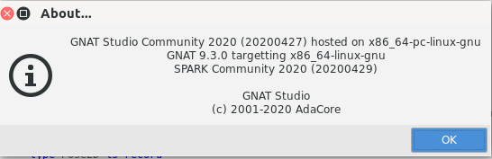
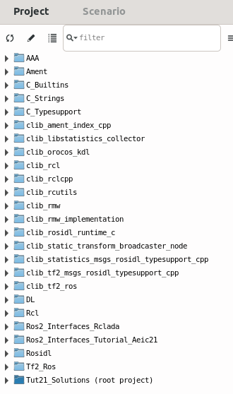

# Exercises

The tutorial is structured in exercises of increasing involvement. The initial tasks (`0.x`), that deal with the setting up of the working environment, are **strongly recommended** to be carried out before the day of the tutorial.

In particular, setting up the *Webots* simulator requires a large download of ~1.5GB (see task `0.3`).

If you find any issues with preparations for the tutorial, please contact me at `amosteo@unizar.es`or open an issue at https://github.com/ada-ros/tutorial-aeic21/issues.

[TOC]

## 0. Setup of the working environment

Firstly, we will set up a plain ROS2 environment. With this, we would be ready
to develop ROS2 packages in C, C++ or Python. Subsequently, we will set up the
Ada-specific environment.

This tutorial has been designed to be carried out on Ubuntu 20.04 LTS.

### 0.1 ROS2 setup

The simplest way of setting up ROS2 in Ubuntu is from binary packages. Follow
the instructions at
https://docs.ros.org/en/foxy/Installation/Ubuntu-Install-Debians.html, which are
summarized here:

1. Ensure your system locale supports UTF-8 (`locale` command).
1. Install pre-requisite packages:
    1. `sudo apt update && sudo apt install curl gnupg2 lsb-release`
1. Set up the ROS2 keys and apt origin:
    1. `sudo curl -sSL https://raw.githubusercontent.com/ros/rosdistro/master/ros.key  -o /usr/share/keyrings/ros-archive-keyring.gpg`
    1. `echo "deb [arch=$(dpkg --print-architecture) signed-by=/usr/share/keyrings/ros-archive-keyring.gpg] http://packages.ros.org/ros2/ubuntu $(lsb_release -cs) main" | sudo tee /etc/apt/sources.list.d/ros2.list > /dev/null`
1. Install the ROS2 packages:
    1. `sudo apt update`
    1. `sudo apt install ros-foxy-desktop python3-argcomplete`

Our shell is unaware of ROS2 tools until we activate some ROS version. This is
done by sourcing the `/opt/ros/<version>/setup.bash` file (a `zsh` alternative exists too):

> `source /opt/ros/foxy/setup.bash`

Afterwards, we can verify our system is ready by running, for example, the command `ros2` which should now be in our `PATH`.

The `ros-foxy-desktop` package will install a complete suite of packages that
also include demos and tutorials. We are going to use some of these, but
otherwise a more limited set of packages could be installed with
`ros-foxy-ros-base`.

ROS/ROS2 distributions use packages with the prefix `ros-<version>-*`. You may see other ROS2 versions with their base Ubuntu system and support life at https://docs.ros.org/en/rolling/Releases.html.

ROS Foxy, which is used in this tutorial, is the current Long Term Service (LTS) ROS2 distribution. Very recently the next non-LTS version was released. Also, since June 2020, a rolling distribution exists on which development is carried out. RCLAda is developed on the latest LTS release.

#### A note on terminals

Development for ROS/ROS2 tends to require multiple commands run from several
terminals. For this reason, it is advisable to use a terminal that allows
splitting it into sub-terminals. A graphical popular option is `terminator`. An
alternative that will work in most consoles, even non-graphical ones, is `tmux`,
although this one is a bit more complex to learn as it requires learning
shortcuts. (See, e.g., https://tmuxcheatsheet.com/, in particular the section
about *"panes"*.)

Likewise, a terminal that can be called/dismissed quickly may result convenient
to some people. A personal favorite (which also supports splitting) is `guake`,
bound to some unused function key (e.g. `F12`).

### 0.2 RCLAda setup

With the previous steps, and after sourcing the `/opt/ros/foxy/setup.bash` script, we are ready to set up the Ada environment. Full instructions can be found at https://github.com/ada-ros/ada4ros2 and are summarized next:

1. Install the native Ada build tools:
    1. `apt install gnat gnat-gps gprbuild`
    - GNAT CE 2020/2021 will not work as it will complain about a few issues in the Ada codebase.
    - Even after fixing those, you may experience linking problems when mixing code built with the native `g++` and the one packaged with GNAT CE 2020.
    - You **may** use the GNATstudio editor from the Community Edition, if so you prefer, over the older GPS packaged in ubuntu as `gnat-gps`.
1. Clone the RCLAda sources, including submodules, and using the `aeic21` branch:
    1. `git clone --recurse-submodules -b aeic21 https://github.com/ada-ros/ada4ros2`
    - The `ada4ros2` is a mostly empty repository, that is used to bring in several ROS2 packages as submodules. It also contains a few convenience scripts, but nothing necessary *per se* to use RCLAda.
    - The Ada ROS2 packages are detailed in the first part of the tutorial presentation. You can find them under the `src` folder of the repository.
1. Enter the cloned repository:
    1. `cd ada4ros2`
1. Ensure the ROS2 environment is loaded: `source /opt/ros/foxy/setup.bash`
    - There is no ill effect by sourcing the script several times.
1. Build the Ada for ROS2 packages:
    1. `colcon build`
    - `colcon` is the build tool used by ROS2. It is an 'orchestrator' of the build, but it does not mandate a particular method for building a package. It determines dependencies and dispatches to the build method of each package.
    - The build should finish without errors; otherwise we cannot continue.
      - To retry a build from scratch, delete the `build` and `install` folders at the repository root.
    - As part of the build process, `colcon` will create a new `install/setup.bash` script under the current folder.
1. Load the new environment that includes the just-compiled Ada packages:
    1. `source install/setup.bash`
    - ROS2 environments are properly layered, so when the `install/setup.bash` script is generated by the build process, it also will load the pre-existing environment; in this case, the base ROS2 environment. This means that, in a new terminal, it is enough to source the `ada4ros2/install/setup.bash` script to be ready to go.
1. Verify the build succeeded by running, for example:
    1. `ros2 run rclada rclada_selftest_dynamic`
    - Although there may be an error message about a timer, as long as no exceptions are raised, everything is fine.
    - The run should end with a report on allocated memory similar to this one:

```
Total allocated bytes :  425
Total logically deallocated bytes :  425
Total physically deallocated bytes :  0
Current Water Mark:  0
High Water Mark:  425
```

If you experience difficulties setting up the environment, or do not have an Ubuntu base system, there are a couple of alternatives you may try. These alternatives are described in the "Alternatives" section.

### 0.3 Extra tools

A few useful packages are left out by the ros2 install desktop installation.

1. Install extra packages by running:
   1. `sudo apt install ros-foxy-rqt* ros-foxy-webots-ros2
2. Source the `setup.bash` script again to include these packages:
   1. `source /opt/ros/foxy/setup.bash`
3. Install the *Webots* simulator by running (ensure you have a few GBs of free space beforehand):
   1. ros2 launch webots_ros2_epuck robot_launch.py
      * You'll receive a prompt asking to install the simulator at a default location. After accepting, a large download will occur. After the installation, a simulator window should open if everything was installed correctly. You can close this window before continuing.

### Alternatives: gitpod

GitPod is a remote development environment that allows to run VSCode in a browser, with a particular environment generated with Docker underneath. This approach serves for the first exercises, that do not require graphical windows. For this reason, it is recommended as a last resort for this tutorial, or as a temporary measure while the previous instructions are completed.

The gitpod service is free for open source projects, but it requires an account on Github/Gitlab/Bitbucket.

Launch the prepared gitpod environment by following this link:

> https://gitpod.io/#https://github.com/ada-ros/ada4ros2/tree/feat/tut-21

An error in the terminal of VSCode like this:

```
ls: cannot access '/home/gitpod/.bashrc.d/*': No such file or directory
```

comes from the own Gitpod service and is inoffensive.

The Gitpod session already has ROS2 preinstalled, and the underlying Docker is an Ubuntu 20.04. Thus, it is enough to do the following in the VSCode terminal to catch up to the end of the RCLAda setup section:

1. `source /opt/ros/foxy/setup.bash`
2. `colcon build`

### Alternatives: docker

NOTE: this approach is only recommended for users already familiar with docker, and that already have docker installed.

A slightly more powerful alternative to GitPod is to use a Docker image that already contains the ROS2 environment. This may allow to successfully follow the tutorial in another Linux other than Ubuntu 20.04. The image tag is `mosteo/ada4ros2:foxy`

This image contains some graphical packages (like `turtlesim`) which enable the realization of a few more exercises. Still, the exercises involving the full blown simulator cannot be carried out this way.

To simplify the task of running graphical applications inside a docker, the recommended approach is to use the `rocker` tool. This tool is distributed via the same repositories as ROS2. Hence, after setting up the ROS2 sources (task `0.1`, step 3), it can be installed by running:

1. `sudo apt install python3-rocker`

Afterwards, the recommendation is to launch a terminator window from the docker, and keep this terminal always open:

1. `rocker --x11 --user --home mosteo/ada4ros2:foxy terminator`
   * The `--user` option may not work and can be left out if you get an error. In that case, the terminal will be open with root as the user, and the first step should be to create a regular user with `adduser <username>`, and then change to it with `su <username>`.
   * Note that the above command will mount your home directory inside the docker, at `/home/<your user>`. Thus, it is dangerous to run commands as root in that environment.

This solution already has the ROS2 environment loaded. (No need to source the `/opt/ros/foxy/setup.bash` script.)

## 1. Ada development environments for ROS2

In this section you will create your first ROS2 package containing a GNAT project. Afterwards, a couple of options for the edition/compiling/running cycle will be examined.

In the following, it is assumed that you are working inside a clone of the `ada4ros2` repository, as described in task 0.2. This may be located anywhere, but for the rest of the exercises the documentation will assume this repository is checked out at `$HOME/ada4ros2`, or `~/ada4ros2` for short.

### 1.1 Creating a new ROS2 package

ROS2 packages require the following elements to be ready to work:

1. A `package.xml` file that describes the package and allows `colcon` to invoke the proper build method on it, after all its dependencies have been built.
2. Build-method-specific files that carry out the actual compilation. In the case of C++/Ada packages, this is achieved by a CMake `CMakeLists.txt` file. 
3. For Ada packages, in addition, a `gprbuild` project has to be provided.

Steps 1 and 2 can be jump-started by using the `ros2 pkg` subcommands. Follow these steps to create your first Ada ROS2 package:

1. Run `ros2 pkg create` without more arguments to get an idea of the parameters that can be used to create a package.

2. Create a package by running

   1. `ros2 pkg create my_ada_package --dependencies rclada_common --description "My first Ada ROS2 package"`
      * This command will create a `my_ada_package` folder under the folder where the command was run. By convention, packages are either at the root of the repository or under the `src` folder. You can leave the created `my_ada_package`folder at its current location or move it under `src`. This does not make a difference for `colcon`.
      * By convention, all ROS2 package names have to be in lowercase.  If we were to use `my_Ada_package` we would get nagging warnings about it.

3. Verify the package was correctly created and is detected by `colcon` by running

   1. `colcon graph`

      * The previous command should show the following output:

        ```
        rclada_common           +***...**
        my_ada_package           +       
        rosidl_generator_ada      +*....*
        rclada                     +*****
        rclada_client_skeleton      +    
        rclada_examples              +   
        rclada_fosdem20               +  
        rclada_tf2                     +*
        tutorial_aeic21                 +
        ```

      * Note how our package depends on `rclada_common`, as we requested during creation.

   2. Examine the `my_ada_package/package.xml` file to see how the description and package version could be updated; and how more dependencies could be added.

In the following exercises we will see a few alternatives for editing our package. For now, we have a plain C++ package; soon we will turn it into an Ada package in task 1.3.

### 1.2 Plain build & edit with colcon

The simplest way of working is by using any editor and compiling/running from the command line. Try the following alternatives:

1. Simply rebuild all packages in the workspace:
   1. `colcon build`
      This is an expensive option because it will rebuild all packages in the workspace. Although some recompilations are avoided by CMake and `gprbuild`, the process still can be time consuming. Also, some files are regenerated and are compiled every time.
2. Build our package and all its transitive dependencies:
   1. `colcon build --packages-up-to my_ada_package`
      This is a slightly better choice since any packages not needed by our target package are not recompiled.
3. Build just our package:
   1. `colcon build --packages-select my_ada_package`
      This option is the fastest one, but can only be used once all dependencies have been previously compiled and sourced with `source install/setup.bash`.

After a successful build, the environment must be updated so executables and libraries are properly located:

1. `source install/setup.bash`
   Test that ROS2 now detects our package, even if it does not yet build any executables or libraries. Try to autocomplete the package name by typing:
2. `ros2 pkg prefix my[⇥TAB]`
   And the response should be something similar to `/home/user/ada4ros2/install/my_ada_package`

#### In desperate times

At some point you may find yourself in a situation where compilation throws strange errors, the GNAT projects don't load, and the environment seems broken. At these times the safest fallback is to rebuild from scratch. To that end, you need to delete all build products and recompile with the initial ROS2 environment:

1. `source /opt/ros/foxy/setup.bash`
2. `rm -rf build install`
   Beware that you do not delete anything unintended with the previous command! This is to be run from the repository root.
3. `colcon build`
4. `source install/setup.bash`

### 1.3 Create a GNAT project for your package

If you examine the `my_ada_package/CMakeLists.txt`, you will see that there are no useful things built. Indeed, this file can be stripped down to the bare minimum:

```cmake
# CMakeLists.txt

cmake_minimum_required(VERSION 3.5)
project(my_ada_package)

find_package(ament_cmake REQUIRED)
find_package(rclada_common REQUIRED)
```

1. Do so and remove all lines but the ones show above.
   **NOTE**: in particular, the line `ament_package()` *must* be removed.

The `package.xml` and `CMakeLists.txt` are independent; the former express dependencies for colcon, while the latter does the same for CMake. Hence, any dependency additions have to be manually made in both files.

#### Creating the Ada project

The RCLAda project defines CMake functions to simplify integration of GNAT projects. Firstly, we will create an empty Ada project. Do it the way you would normally do. For example:

* If you have `alr` installed, enter the `my_ada_package` folder and run `alr init --bin ada_code`. This will create an `ada_code` nested folder with a ready-to-use GNAT project.
* If you do not have `alr`, you can run `gnat-gps` or `gnatstudio` and, in the welcome window, choose `"Create a new project..."`. Then, select the basic simple Ada project:
  
  * It is recommended to place the new project in its own subfolder. This way, several projects can cohabit inside one ROS2 package.

Verify that you can build the project, either using the GUI options or by running `gprbuild` inside the project folder.

We need now to include this project in the build process of ROS2. To do so,

1. ​	Add the following lines to the end of the `my_ada_package/CMakeLists.txt`file:

   ```cmake
   ada_begin_package()	# Retrieves Ada context from other Ada packages that are dependencies
   
   ada_add_executables(
   	ada_code	# This is a CMake target name, so anything goes.
   	${PROJECT_SOURCE_DIR}/ada_code 
   				# ABSOLUTE path to the GNAT project root inside the package.
   				# By using ${PROJECT_SOURCE_DIR} provided by CMake, we ensure the proper
                   #   location is picked even if the repository is moved.
       obj         # Relative path to the binary output, as defined in the GPR project file.
       main		# Executables built by your Ada project, without path.
       )
   
   ada_end_package()	# Exports the updated Ada context for possible dependent packages.
   ```

   **NOTE**  that the second argument to `ada_add_executables` must be adjusted for the place were you created your GNAT project inside the package. `${PROJECT_SOURCE_DIR}` points to the `CMakeLists.txt` file containing folder, so it is handy for this purpose.

   **NOTE** that the third argument is the relative path defined in your GPR file with the `for Object_Dir use "obj";` (default location for projects created with `gnat-gps` or `or Executable_Dir use "bin";` (default location for projects created with `alr`).

   > The `ada_add_executables` ensures that the Ada environment is imported/exported properly in regard to other Ada ROS2 packages. Also it places the resulting executables where ROS2 expects to find them.

2. Run `colcon build --packages-up-to my_ada_package` until you get no errors. If you *do* get errors, remove the `build` and `install ` folders before invoking colcon, as otherwise old versions of your `CMakeFiles.txt` can be used unexpectedly.

3. Source the environment:
   `source install/setup.bash`

4. Run your executable (adjust for the name you actually used for it -- also try using TAB completion):
   `ros2 run my_ada_package main`

5. Edit your main file so it prints something, and verify the changes by rebuilding and running your very first ROS2 executable.

**CONGRATULATIONS!** It may seem a trivial step, but having your Ada code built in the context of other ROS2 packages is  the very first step needed to build actual robotics code.

### 1.4 Edit with VSCode

Now that we have a foundation to start doing actual code, usually we will do so using a GUI (if you are happy with editors like `vim`, you obviously can simply go ahead with it and build from another terminal.

Assuming you want a graphical alternative, the first stop may be the now popular VSCode. It has the advantage of many plugins (including one for Ada), and flexible task definitions. Also, as VSCode does not depend on successfully loading a GNAT project file, it is an excellent fallback when problems arise with GNATstudio/GPS in that regard.

> If you wonder why a project file would not load, the trouble in the ROS2 context is that there is file generation involved. Any error in the `colcon build` process may leave us with an incomplete set of files/projects, and *opening* a project in that situation with GNAT is impossible.

If you do not have VSCode installed, you can get it with:

* `snap install code`

The recommended route is to use `File -> Open folder...` to open the `ada4ros2` repository root, and have easy navigation around all repository files in all the contained ROS2 packages.

There are already some tasks defined in the `ada4ros2/.vscode` folder to build, clean & build, update the build and build only the current file by using `Terminal -> Run task...`

Another straightforward possibility is to run `colcon` from the terminal embedded in VSCode.

### 1.5 Edit and compile with GNATstudio/GPS

You may start to realize that running `colcon build` every time and then navigating to errors by hand is going to be a suboptimal experience. The optimal situation, if you are already an user of GNATstudio/GPS, would be to be able to use them as with regular Ada standalone projects.

For an isolated project like the one we just created in the preceding exercises, there is indeed nothing preventing doing exactly that. The trouble starts when we are using Ada projects in other packages (as we will shortly doing to use the `RCLAda` binding, for example). `colcon build`, for starters, does an out-of-tree build in the `./build` folder; the final executables, libraries and generated GPR project files are furthermore located in the `./install` folder. This results in a fragile situation in which only after a complete successful build we can use GNATstudio/GPS (as they require a valid GPR project, with all the dependencies being available).

Just as an example, we will open the project containing the solutions to the remaining exercises now, with `gnat-gps` (or `gnatstudio`).

1. Build the complete workspace:
   `colcon build`

2. Run the `printenv_ada` script  to inspect the environment that is needed to build/load projects with gnatstudio/gprbuild:
   `./printenv_ada`
   The output should be something like:

   > export GPR_PROJECT_PATH="/home/user/prog/ada4ros2/src/rclada_client_skeleton:/home/user/prog/ada4ros2/src/rclada_common/gpr_aaa:/home/user/prog/ada4ros2/src/rclada_common/gpr_ament:/home/user/prog/ada4ros2/src/rclada_common/gpr_c_builtins:/home/user/prog/ada4ros2/src/rclada_common/gpr_cstrings:/home/user/prog/ada4ros2/src/rclada_examples:/home/user/prog/ada4ros2/src/rclada_fosdem20:/home/user/prog/ada4ros2/src/rclada/gpr_rcl:/home/user/prog/ada4ros2/src/rclada/gpr_selftest:/home/user/prog/ada4ros2/src/rclada_tf2/gpr_examples:/home/user/prog/ada4ros2/src/rclada_tf2/gpr_tf2_ros:/home/user/prog/ada4ros2/src/rosidl_generator_ada/gpr_c_typesupport:/home/user/prog/ada4ros2/src/rosidl_generator_ada/gpr_generator:/home/user/prog/ada4ros2/src/rosidl_generator_ada/gpr_rosidl:/home/user/prog/ada4ros2/src/rosidl_generator_ada/gpr_rosidl/dl-ada:/home/user/prog/ada4ros2/src/rosidl_generator_ada/gpr_rosidl/dl-ada/cstrings:/home/user/prog/ada4ros2/src/tutorial_aeic21/gpr_exercises:/home/user/prog/ada4ros2/src/tutorial_aeic21/gpr_solutions:/home/user/prog/ada4ros2/install/rclada_common/share/gpr:/home/user/prog/ada4ros2/install/rclada_examples/share/gpr:/home/user/prog/ada4ros2/install/rclada_fosdem20/share/gpr:/home/user/prog/ada4ros2/install/rclada/share/gpr:/home/user/prog/ada4ros2/install/rclada_tf2/share/gpr:/home/user/prog/ada4ros2/install/rosidl_generator_ada/share/gpr:/home/user/prog/ada4ros2/install/tutorial_aeic21/share/gpr"

   **NOTE**: the `printenv_ada` assumes that all packages are under `./src`.

3. Actually do load this Ada environment:
   `source <(./printenv_ada)`

4. Open the project with the solutions in GNATstudio/gnat-gps

   * With gnat-gps: `gnat-gps -P src/tutorial_aeic21/gpr_solutions/tut21_solutions.gpr`

   * With gnatstudio: `path/to/gnatstudio -P src/tutorial_aeic21/gpr_solutions/tut21_solutions.gpr`

     * NOTE: the gnat compiler in the path should be the one in `/usr/bin` and not the one in the Community Edition; otherwise compilation will fail. You can verify the version in use from within gnatstudio by going to `Help -> About...`:
        

       and the version should be, as shown, GNAT 9.3.0 from Ubuntu's `gnat` package.

   * After successfully opening the root project, all *withed* projects and sources are accessible through the Project view:
     

5. Build everything with `Build -> Project -> Build all`

   * **Note**: since the compilation is now happening *in-tree*, everything will be recompiled and the final executables will be in the source tree, and not in the `build` or `install ` folders. Keep this in mind to run the appropriate final binaries in case of changes.
   * The advantage of editing this way is that now `colcon` is not needed to make changes and rebuild, and `gprbuild` will indeed recompile only the required sources for any changes. This is in general much faster. Also, navigation through Ada sources with Ctrl+Click is much more robust in GNATstudio vs VSCode.

6. Verify that only minimal recompilation is happening by opening, for example, `sol_publisher_static.adb` in the root project (`Tut21_Solutions`) and modifying some of the strings in there, and rebuilding like in the previous step.

   * Undo the changes after the test.

### Conclusion

In this block we have seen, firstly, how to create a new ROS2 package and how to integrate in it a GNAT project; and finally, how edition and compilation of Ada sources in the context of ROS2 packages can be achieved, from raw `colcon` in the terminal to the practicality of a full-fledged Ada GUI such as GNATstudio. 

## 2. Blackboard communication (topics/publishers/subscriptions)

From this point on, all exercises are ROS2 nodes written in Ada. Each exercise source code is provided twice:

1. In project `ada4ros2/src/tutorial_aeic21/gpr_exercises/tut21_exercises.gpr`
   * These files are intended to guide you via comments on the objectives of the exercise, and to have a file ready to start without requiring you to create a new package, Ada project, etc. The intention is that you edit these files directly to complete the exercise.
2. In project `ada4ros2/src/tutorial_aeic21/gpr_tutorials/tut21_solutions.gpr`
   * The files in this project are prefixed with `sol_` and are a reference implementation of the exercise. You can use these to get ideas, check the intended behavior of the result, quickly try modifications on a complete solution, etc.

For convenient edition/comparison of any of these files, the project `ada4ros2/src/tutorial_aeic21/tutorial.gpr` is recommended. It is an aggregate project that merely includes both `tut21_*.gpr` projects.

> This `tutorial.gpr` project file 

In summary, from the `ada4ros2` repository root:

1. `colcon build`
2. `source <(./printenv_ada)`
3. `gnat-gps -P src/tutorial_aeic21/tutorial.gpr`

### Using RCLAda dynamic vs static messages

For technical reasons, RCLAda offers two ways of accessing information in a ROS2 message:

1. Through runtime introspection, with a small runtime overhead, but with full guarantees that the worst that can happen is an exception when erroneous access is attempted.
2. Through record types generated during the build, following ROS tradition. Improper use of these types may result in unguarded accesses to invalid memory, as they closely match C memory layouts. This is, however, the expected usage. Future releases of RCLAda will improve the safety aspect of this approach.

For the exercises in this block 2, and to get acquainted with both methods, it is recommended to complete either exercises 2.1+2.4 or 2.2+2.3.

* 2.1/2.2 do the same, but using the dynamic/static version.
* 2.3/2.4 do the same, but using the dynamic/static version.
* In tandem, you will be creating a publisher and a subscriber able to relay and receive information.

For each exercise you will receive this information here (and the comments in the exercise main file):

- Objective: *A brief description of the purpose of the exercise and learning goal.*
- Main file:  The name of the Ada file to be completed; e.g., `cool_exercise.adb`. This means that a `sol_cool_exercise.adb` also exists with the complete implementation.
- APIs: A list of `project.gpr/specification.ads` files that are relevant to the completion of the exercise, and that have not appeared before. 
- Tools: A list of command-line commands from ROS2 that can be helpful for the exercise. Running them without arguments or with `--help` to get details is recommended.

### 2.1 Writing a Publisher, dynamic version

- Objective:
- Main file: 
- APIs:
- Tools:

publisher_dynamic.adb

Verify with `ros2 topic echo <topic>`

Also `ros2 topic {info|type}`

### 2.2 Writing a Publisher, static version

publisher_static.adb

### 2.3 Writing a Subscriber, dynamic version

subscriber_dynamic.adb

$ ros2 topic pub /chatter std_msgs/msg/String 'data: "hello"'

See that autocompletion works for ros2 topic etc.

### 2.4 Writing a Subscriber, static version

subscriber_static.adb

### TurtleSim: first steps

(TODO: slide with turtle + axes)

`ros2 run turtlesim turtlesim_node`

`ros2 topic list`

Identify `/turtle1/cmd_vel`, `/turtle1/pose`

Identify type of these topics with `ros2 topic type`

`geometry_msgs/msg/Twist`
`turtlesim/msg/Pose`

Do a fixed sequence (parameterized?)

Create a remote controller

Improve the remote controller by showing the current pose (with colors!)

- Draw some figure

### ePuck: first steps

`ros2 launch webots_ros2_epuck robot_launch.py`

Identify name and type of command topic. Conclusion?

Update the remote controller of turtlesim to control the epuck

### Conclusion

## 3. RPC communication (services/servers/clients)

### Servers

Server_Example

Test with `$ ros2 service call /ada_service std_srvs/srv/Trigger {}`

The last `{}` can be omitted: empty message.

### Asynchronous clients

Client_Async

Play with the different timeouts to see what happens. Play with launching the server before/after the client.

Warning after response is due to listener destruction

No timeouts may result in call lost because topic discovery take a few seconds. Wait with the node up for a while.

### Synchronous clients

Client_Sync

### Conclusion

## 4. Realistic exercises

### Wandering robot with obstacle avoidance (Roomba-like)

Epuck_Wander

Turtlebot_Wander

### Navigate to a local goal (VFH local planner)

Turtlebot_VFH

### Transformations

https://blog.hadabot.com/ros2-navigation-tf2-tutorial-using-turtlesim.html

ros2 run tf2_ros tf2_echo
ros2 run tf2_ros tf2_monitor

### Conclusion

## 5. Defining your own messages

### Conclusion